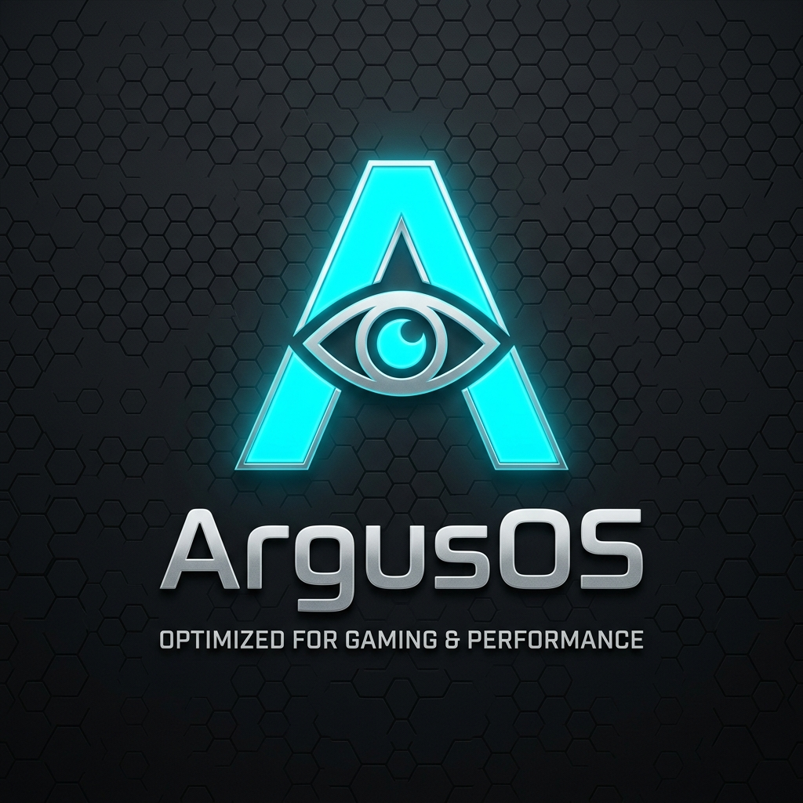

<div align="center">
  
  
  # ⚡ ArgusOS ⚡
  
  ### **Optimized Custom Windows Configuration & Gaming Toolkit**
  
  [](LICENSE)
  [](https://github.com/ar4us/ArgusOs/stargazers)
  [](https://microsoft.com/windows)

  ---
  
  **ArgusOS** is a premium, high-performance custom Windows operating system playbook and utility toolkit. Engineered specifically for competitive gaming, power users, and stream setups, it dramatically reduces system latency, debloats background telemetry, and optimizes system responsiveness.
</div>

---

## 🚀 Key Highlights

### ⚡ Performance & Kernel Optimization
- **Lower Input Lag**: Custom kernel, scheduler, and memory management optimizations to ensure maximum CPU allocation for active games.
- **Debloated Services**: Disables non-essential Windows telemetry, background services, and bloatware without breaking system stability.
- **Dynamic Power Management**: Custom power plan configured specifically for laptops and desktops to manage energy and CPU boosting.

### 🛡️ Exploit Protection & Stability (DEP Enabled)
- Unlike unstable optimization playbooks that disable security features and cause modern Chromium browsers or Electron apps (like Discord, OpenCode) to crash, **ArgusOS keeps system process mitigations and DEP (Data Execution Prevention) enabled**.
- Full stability for all modern apps while retaining elite gaming optimizations.

### 🎨 Visual & OEM Customization
- Clean visual layout featuring a custom default lock screen and desktop wallpaper.
- Integrated OEM customization (custom Manufacturer info and Support URLs).

### 🛠️ Argus Toolkit
- **Premium WPF/XAML Dashboard**: Dark-mode user interface designed with clean cyan accents.
- **Silent App Installer (82+ Options)**: Deploy browsers, launchers, messaging platforms, developer tools, and diagnostic utilities in one click.
- **Chocolatey & Winget Integration**: Installs Chocolatey automatically to deploy runtimes like Adoptium Java JDK, DirectX, VC++ Redistributables (AIO), and .NET Frameworks.

---

## 📁 Repository Structure

```
ArgusOs/
├── playbook/               # Source configuration files of the AME Playbook
│   ├── Configuration/      # custom.yml actions and registry tweaks
│   └── Executables/        # Helper scripts, power plans, and wallpapers
├── toolkit/                # Source code for the Argus Toolkit
│   ├── Argus-Toolkit.ps1   # WPF user interface script backend
│   ├── compile_toolkit.ps1 # Auto-compiler script to compile PS1 to EXE
│   └── rebuild_playbook.ps1# Asset rebuild and migration pipeline
├── ArgusOS.apbx            # The compiled Playbook file (Password: malte)
├── Argus-Toolkit.exe       # Standalone compiled toolkit executable
├── walkthrough.md          # Architectural changes and deployment guide
└── task.md                 # Development checklist and roadmap
```

---

## 🔧 Installation Guide

### Step 1: Run the Playbook via AME Wizard
1. Download [ArgusOS.apbx](ArgusOS.apbx) from the repository.
2. Open **AME Wizard** on your PC.
3. Drag and drop `ArgusOS.apbx` into AME Wizard.
4. Enter the decryption password: `malte`
5. Customize options (toggle Defender, remove Edge, toggle printing services) and apply.
6. The system will reboot automatically once finished.

### Step 2: Use the Argus Toolkit to Install Apps
1. Open **`Argus-Toolkit.exe`** as Administrator.
2. Check the applications you want to deploy from the 3-column scrollable list.
3. Click **Install Selected** to silently install them via `winget` or `chocolatey`.
4. Monitor progress in real-time through the status log bar.

---

<div align="center">
  <p>Created with ⚡ by <a href="https://github.com/ar4us">ar4us</a></p>
</div>
